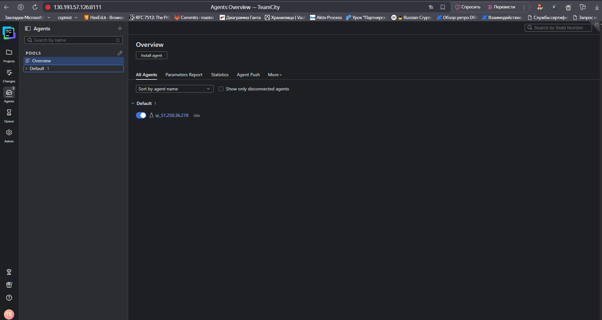
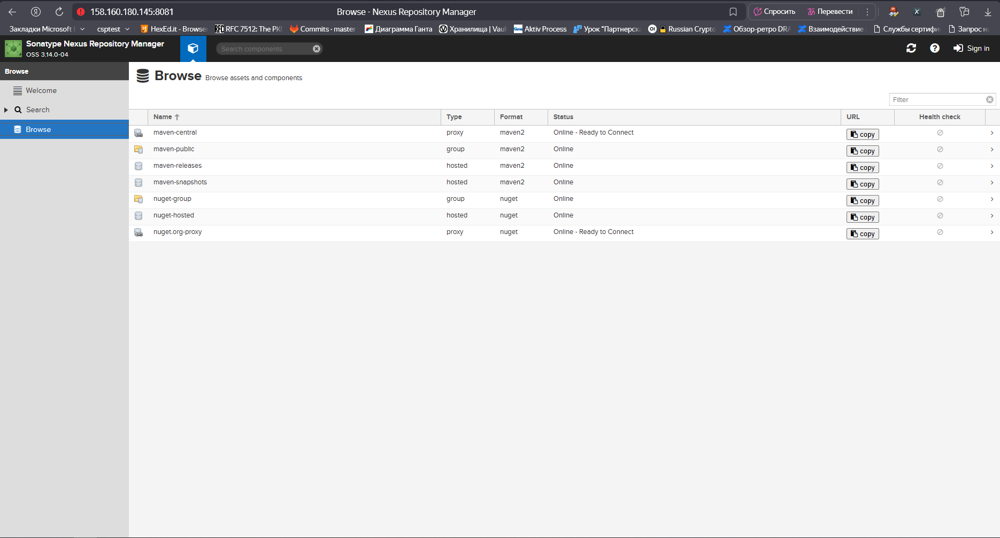
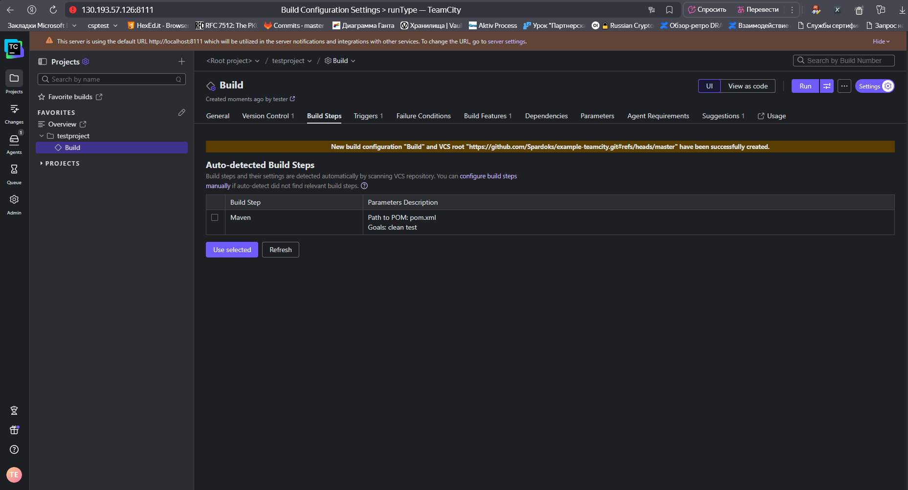
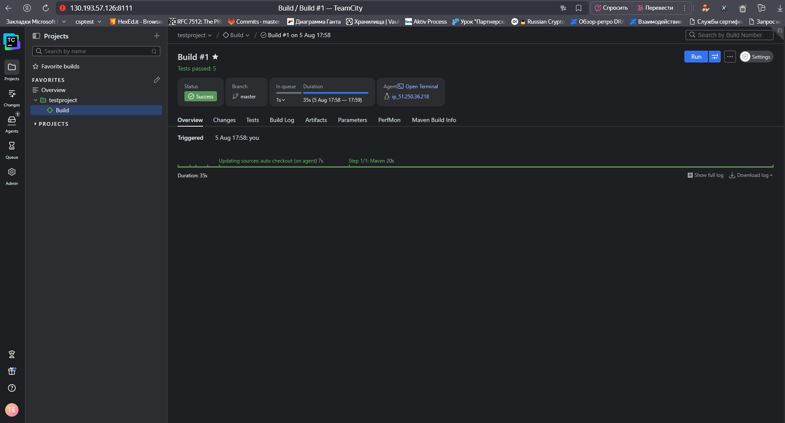
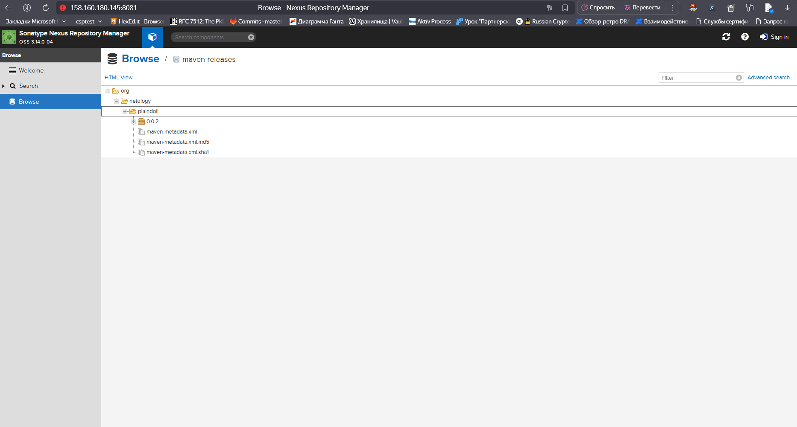
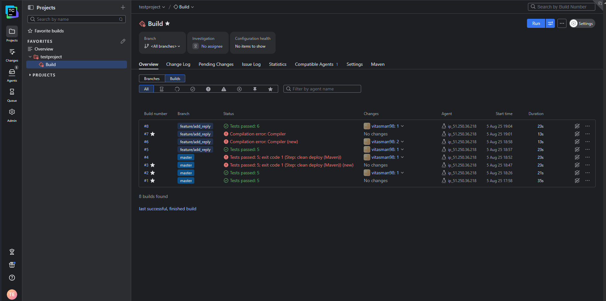
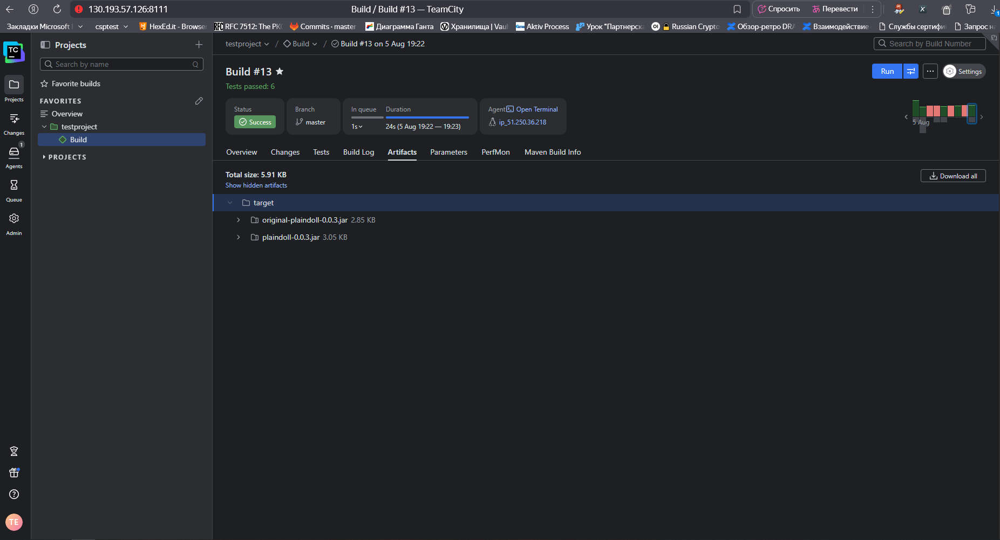

# Домашнее задание к занятию «Teamcity»

https://github.com/netology-code/mnt-homeworks/blob/MNT-video/09-ci-05-teamcity/README.md

## Подготовка к выполнению

1. В Yandex Cloud создайте новый инстанс (4CPU4RAM) на основе образа `jetbrains/teamcity-server`.
2. Дождитесь запуска teamcity, выполните первоначальную настройку.
3. Создайте ещё один инстанс (2CPU4RAM) на основе образа `jetbrains/teamcity-agent`. Пропишите к нему переменную окружения `SERVER_URL: "http://<teamcity_url>:8111"`.
4. Авторизуйте агент.
5. Сделайте fork [репозитория](https://github.com/aragastmatb/example-teamcity).
6. Создайте VM (2CPU4RAM) и запустите [playbook](./infrastructure).

## Основная часть

1. Создайте новый проект в teamcity на основе fork.
2. Сделайте autodetect конфигурации.
3. Сохраните необходимые шаги, запустите первую сборку master.
4. Поменяйте условия сборки: если сборка по ветке `master`, то должен происходит `mvn clean deploy`, иначе `mvn clean test`.
5. Для deploy будет необходимо загрузить settings.xml в набор конфигураций maven у teamcity, предварительно записав туда креды для подключения к nexus.
6. В pom.xml необходимо поменять ссылки на репозиторий и nexus.
7. Запустите сборку по master, убедитесь, что всё прошло успешно и артефакт появился в nexus.
8. Мигрируйте `build configuration` в репозиторий.
9. Создайте отдельную ветку `feature/add_reply` в репозитории.
10. Напишите новый метод для класса Welcomer: метод должен возвращать произвольную реплику, содержащую слово `hunter`.
11. Дополните тест для нового метода на поиск слова `hunter` в новой реплике.
12. Сделайте push всех изменений в новую ветку репозитория.
13. Убедитесь, что сборка самостоятельно запустилась, тесты прошли успешно.
14. Внесите изменения из произвольной ветки `feature/add_reply` в `master` через `Merge`.
15. Убедитесь, что нет собранного артефакта в сборке по ветке `master`.
16. Настройте конфигурацию так, чтобы она собирала `.jar` в артефакты сборки.
17. Проведите повторную сборку мастера, убедитесь, что сбора прошла успешно и артефакты собраны.
18. Проверьте, что конфигурация в репозитории содержит все настройки конфигурации из teamcity.
19. В ответе пришлите ссылку на репозиторий.

---

## Выполнение

1. Готовим agent и server из образов



2. Готовим Nexus на основе ansible playbook
    ```
    ubuntu 24-04

    cat inventory/cicd/hosts.yml

    ---
    all:
      hosts:
        nexus-01:
          ansible_host: 158.160.180.145
      children:
        nexus:
          hosts:
            nexus-01:
      vars:
        ansible_connection: local
        ansible_user: tester

    ansible -m ping -i inventory/cicd/hosts.yml all
    sudo ansible-playbook site.yml -i inventory/cicd/hosts.yml
    "No package matching 'java-1.8.0-openjdk' is available"
    openjdk-8-jre, openjdk-8-jdk
    https://docs.github.com/en/authentication/connecting-to-github-with-ssh/generating-a-new-ssh-key-and-adding-it-to-the-ssh-agent
    https://openjdk.org/install/
    ```
    


3. Создаём новый проект в teamcity на основе fork и делаем autodetect конфигурации



4. Запускаем первую сборку master



5. Меняем условия сборки: если сборка по ветке `master`, то должен происходит `mvn clean deploy`, иначе `mvn clean test`. Для deploy загружаем [settings.xml](./settings.xml) в набор конфигураций maven у teamcity предварительно записав туда креды для подключения к nexus.


6. В [pom.xml](./pom.xml) помещаем ссылки на репозиторий и nexus.


7. Запускаем сборку по master, убеждаемся, что всё прошло успешно и артефакт появился в nexus.



8. Мигрируем `build configuration` в репозиторий - [build_config](./build_config.kt).


9. Создаём отдельную ветку `feature/add_reply` в репозитории. Создаём новый метод для класса Welcomer: метод олжен возвращать произвольную реплику, содержащую слово `hunter`. Дополняем тест для нового метода на поиск слова `hunter` в новой реплике. Делаем push всех изменений в новую ветку репозитория. Убеждаемся, что сборка самостоятельно запустилась, тесты прошли успешно.



10. Убеждаемся, что нет собранного артефакта в сборке по ветке `master`. Настраиваем конфигурацию так, чтобы она собирала `.jar` в артефакты сборки. Проводим повторную сборку мастера, убеждаемся, что сбора прошла успешно и артефакты собраны.


---